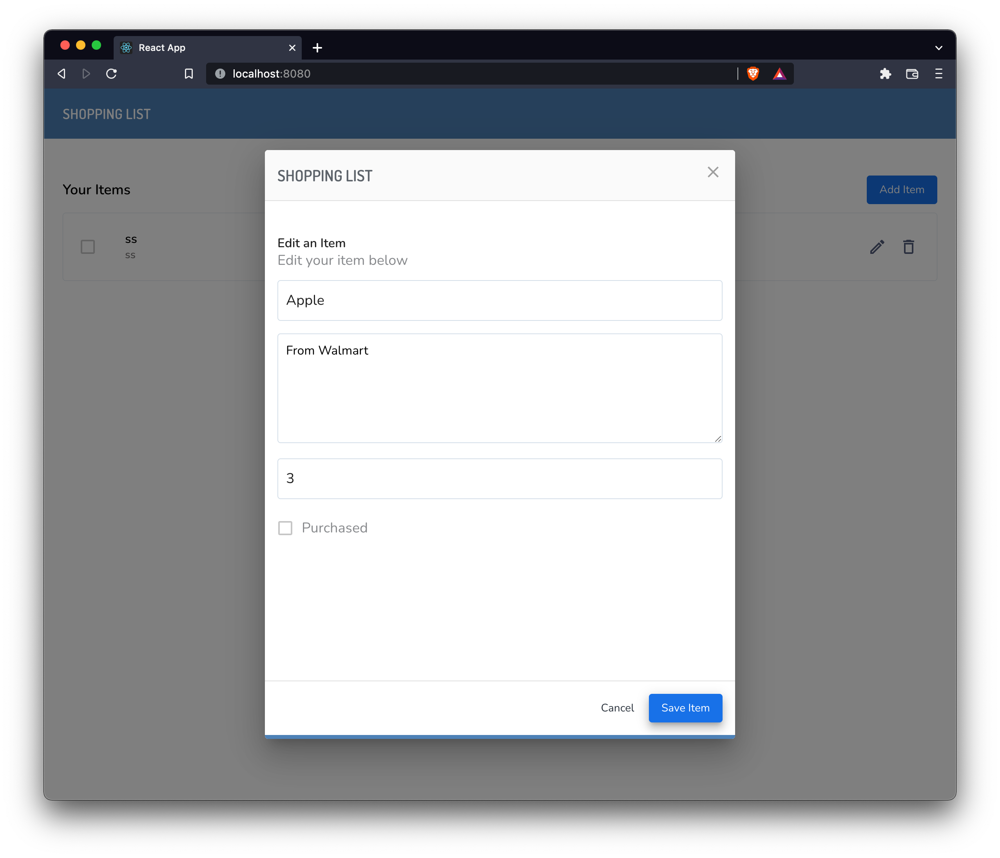

# Shopping List - Full Stack App

This repository contains a full-stack application, using [MVVM](https://en.wikipedia.org/wiki/Model%E2%80%93view%E2%80%93viewmodel) pattern on the front-end.

### UI - Figma File
[Figma Demo](https://www.figma.com/file/FP6nTXF1nqA9J5QFk0ieHi/DEMO-UI-TEST?node-id=0%3A1)

## Warning

This application and its services are not production ready, and is not propely configured for deployment.

## Screenshot


### Front-End Stack 
- [React](https://reactjs.org/)
- [Typescript](https://www.typescriptlang.org/)
- [Axios](https://axios-http.com/docs/intro) (Http Client)
- [Formik](https://formik.org/) (Form)
- [Yup](https://www.npmjs.com/package/yup) (Form Validation)
- [Material UI](https://mui.com/) (UI Framewrok)
- [Mobx](https://mobx.js.org/README.html) (state management)

### Backend-End Stack 
- [Node js](https://nodejs.org/en/)
- [Sequilize](https://sequelize.org/) (DB ORM)
- [Express](https://expressjs.com/)
- [Express Generator Typescript](https://www.npmjs.com/package/express-generator-typescript)

### Infrastructure
- [Docker](https://www.docker.com/)
- [NginX](https://www.nginx.com/) (Reverse proxy)

## Running the App

Make sure you have installed [Docker](https://www.docker.com/) on your machine.

```sh
cd shopping-list
```
Run the containers
```sh
docker-compose up
```
After having 4 container running 
- Postgres
- node-backend
- node-frontend
- nginx

Access to: [http://localhost:8080](http://localhost:8080/)


## Autor

[Victor Santos](https://vsantos.info)


